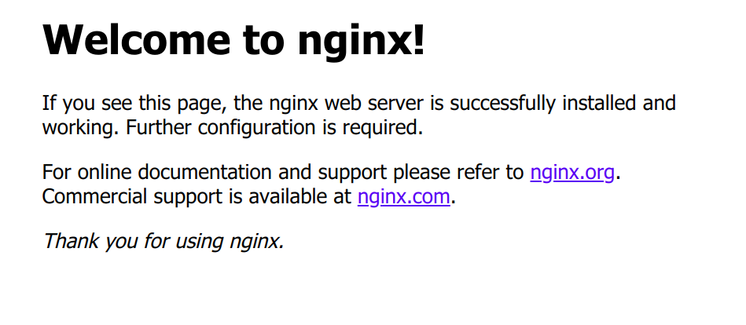

[toc]

# 环境配置

## 重装阿里云服务器

- 登录到阿里云ECS云服务器控制台；

- 找到需要重装系统的ECS实例，先停止实例：点击“更多”---“实例状态”---“停止”
    （如果实例已经停止，请忽略此步骤）

- 点击“更多”---“磁盘和镜像”---“更换系统盘”

    > 重装系统即更换系统盘。更换系统盘原系统盘会被释放，数据无法恢复，所以，更换系统盘之前一定要做好备份！

## 阿里云服务器添加本地的ssh秘钥

- 先删除之前保存的私钥

    ```shell
    ssh-keygen -f "/home/user/.ssh/known_hosts" -R "server"
    ```

- 在阿里云控制台创建新的秘钥对，下载私钥到桌面，并绑定到相应的实例

- 在客户端使用如下命令连接

    ```shell
    # 连接
    ssh -i Desktop/somename.pem root@server
    
    # 创建一般用户
    sudo adduser <user_name>
    su - <user_name> # 切换到某一个用户
    ```

- 接下来可以用

    ```shell
    ssh <user_name>@116.62.177.102 # 连接
    ```

## 配置阿里云为git代码托管仓库

### 配置

- 在阿里云安装git

    ```shell
    sudo apt install git
    ```

- 创建一个`git`用户用来管理git仓库

    ```shell
    sudo adduser git
    ```

- 将本地客户端的公钥添加到服务器的`/home/git/.ssh/Authoried_keys`, 并赋予相应的执行权限. 

    ```shell
    sudo chmod 700 .ssh
    sudo chmod 600 .ssh/authorized_keys
    ```

- 此外, 还需要配置`/etc/ssh/sshd_config`

    将`#AuthorizedKeysFile %h/.ssh/authorized_keys`修改为`AuthorizedKeysFile /home/git/.ssh/authorized_keys`

- 设置`git`账户只能使用`git-shell`访问服务器, 而不能直接通过`ssh`登录服务器. 

    - 找到git-shell的可执文件位置`whereis git-shell`

    - 修改`/etc/passwd`文件

        将`git:x:1001:1001:,,,:/home/git:/bin/bash`修改为`git:x:1001:1001:,,,:/home/git:/usr/bin/git-shell`

        > `/usr/bin/git-shell`是git-shell可执行文件的位置. 

### 使用

- 创建一个git空仓库

    ```shell
    sudo git init --bare <name_repository>
    ```

- 让该仓库所属用户为`git`

    ```shell
    sudo chown -R git:git <name_repository>
    ```

# HTML学习

## HTML的网络术语
- 网页 ：由各种标记组成的一个页面就叫网页。
- 主页(首页) : 一个网站的起始页面或者导航页面。
- 标记： `<p>称为开始标记` ，`</p>`称为结束标记，也叫标签。每个标签都规定好了特殊的含义。
- 元素：`<p>内容</p>`称为元素.
- 属性：给每一个标签所做的辅助信息。
- xhtml： 符合XML语法标准的HTML。
- dhtml：dynamic，动态的。`javascript + css + html`合起来的页面就是一个dhtml。
- http：超文本传输协议。用来规定客户端浏览器和服务端交互时数据的一个格式。SMTP：邮件传输协议，ftp：文件传输协议。

- `<!-- --!>`: 使用注释标签来隐藏浏览器不支持的脚本也是一个好习惯


# HTML

## Web 标准

- 结构：html, 表现：css, 行为：JavaScript

web标准总结：

- 结构标准：相当于人的身体。html就是用来制作网页的。
- 表现标准：相当于人的衣服。css就是对网页进行美化的。
- 行为标准：相当于人的动作。JS就是让网页动起来，具有生命力的。

## HTML 规范
- 所有标记元素都要正确的嵌套，不能交叉嵌套。
- 所有的标记都必须小写
- 所有的标记都必须关闭
- 所有的属性值必须加引号
- 所有的属性必须有值
- XHTML文档开头必须要有DTD文档类型定义


> -  所有的浏览器默认情况下都会忽略空格和空行
> -  每个标签都有私有属性。也都有公有属性。
> -  html中表示长度的单位都是像素。HTML只有一种单位就是像素。

HTML标签是分等级的，HTML将所有的标签分为两种：

- 文本级标签：p、span、a、b、i、u、em。文本级标签里只能放文字、图片、表单元素。（a标签里不能放a和input）
- 容器级标签：div、h系列、li、dt、dd。容器级标签里可以放置任何东西。

## 排版标签

块级标签 `<div>`和`<span>`
- div和span是非常重要的标签，div的语义是division“分割”； span的语义就是span“范围、跨度”。
- div：把标签中的内容作为一个块儿来对待(division)。必须单独占据一行。
- `align="属性值"`：设置块儿的位置。属性值可选择：left、right、 center。
- `<span>`和`<div>`唯一的区别在于：`<span>`是不换行的，而`<div>`是换行的
- 两个元素是专门为定义CSS样式而生的。或者说，DIV+CSS来实现各种样式。

## 字体标签

标题使用`<h1>`至`<h6>`标签进行定义`<h1>`定义最大的标题，`<h6>`定义最小的标题。具有align属性，属性值可以是：left、center、right。

特殊字符（转义字符）
- `&nbsp;`：空格 （non-breaking spacing，不断打空格）
- `&lt;`：小于号（less than）
- `&gt;`：大于号（greater than）
- `&amp;`：符号&
- `&quot;`：双引号
- `&apos;`：单引号
- `&copy;`：版权©
- `&trade;`：商标™
- `&#32464;`：文字`绐`。其实，#32464是汉字`绐`的unicode编码。

| 特殊字符 | 描述           | 字符的代码 |
| -------- | -------------- | ---------- |
|          | 空格符         | `&nbsp;`   |
| \<       | 小于号         | ` &lt;`    |
| \>       | 大于号         | ` &gt;`    |
| &        | 和号           | `&amp;`    |
| ￥        | 人民币         | `&yen;`    |
| ©        | 版权           | `&copy;`   |
| ®        | 注册商标       | `&reg;`    |
| °        | 摄氏度         | `&deg;`    |
| ±        | 正负号         | `&plusmn;` |
| ×        | 乘号           | `&times;`  |
| ÷        | 除号           | `&divide;` |
| ²        | 平方2（上标2） | `&sup2;`   |
| ³        | 立方3（上标3） | `&sup3;`   |

其他小标记
- `<u>`：下划线标记
- `<s>`或`<del>`：中划线标记（删除线）
- `<i>`或`<em>`：斜体标记
- `<sup>`: 上标
- `<sub>`: 下标

## 超链接

外部链接: 链接到外部文件
```html
<a href="02页面.html">点击进入另外一个文件</a>
```

锚链接: 给超链接起一个名字，作用是在本页面或者其他页面的的不同位置进行跳转。
- 创建锚点: `<a name="name1">顶部</a>`
- 链接: ``<a href="#name1">回到顶部</a>`

超链接的属性: 
- `href`：目标URL
- `title`：悬停文本。
- `name`：主要用于设置一个锚点的名称。
- `target`：告诉浏览器用什么方式来打开目标页面。target属性有以下几个值：
  - `_self`：在同一个网页中显示（默认值）
  - `_blank`：在新的窗口中打开。
  - `_parent`：在父窗口中显示
  - `_top`：在顶级窗口中显示


## 图片标签
img: 代表的就是一张图片。是单边标记。

img是自封闭标签，也称为单标签。

- 能够插入的图片类型是：jpg(jpeg)、gif、png、bmp
- 不能往网页中插入的图片格式是：psd、ai

属性: 
- `src`: 图片的相对路径和绝对路径

> 关于路径: 绝对不允许使用file://开头的东西，这个是完全错误的！

- `width`：宽度
- `height`：高度
- `Align`：指图片的水平对齐方式，属性值可以是：left、center、right
- `title`：提示性文本。公有属性。也就是鼠标悬停时出现的文本。
- `border`：给图片加边框（描边），单位是像素，边框的颜色是黑色
- `hspace`：指图片左右的边距
- `vspace`：指图片上下的边距
- `alt`：当图片显示不出来的时候，代替图片显示的内容。alt是英语 alternate “替代”的意思。（有的浏览器不支持）

> 注意事项：
> 
>（1）如果要想保证图片等比例缩放，请只设置width和height中其中一个。
>
>（2）如果想实现图文混排的效果，请使用align属性，取值为left或right。

# CSS

CSS 能够对网页中元素位置的排版进行像素级精确控制，支持几乎所有的字体字号样式，拥有对网页对象和模型样式编辑的能力

**层叠**
简单的说，层叠就是对一个元素多次设置同一个样式，这将使用最后一次设置的属性值。例如对一个站点中的多个页面使用了同一套CSS样式表，而某些页面中的某些元素想使用其他样式，就可以针对这些样式单独定义一个样式表应用到页面中。这些后来定义的样式将对前面的样式设置进行重写，在浏览器中看到的将是最后面设置的样式效果。
## 属性和属性值
### 属性
1. 该属性的合法属性值（legal value）。显然段落缩进属性text-indent只能赋给一个表示长度的值，而表示背景图案的background．image属性则应该取一个表示图片位置链接的值或者是关键字none表示不用背景图案。
2. 该属性的默认值（initial value）。当在样式表单中没有规定该属性，而且该属性不能从它的父级元素那儿继承的时候，则浏览器将认为该属性取它的默认值。
3. 该属性所适用的元素（Applies to）。有的属性只适用于某些个别的元素，比如white-space属性就只适用于块级元素。white-space属性可以取normal、pre和nowrap三个值。当取normal的时候，浏览器将忽略掉连续的空白字符，而只显示一个空白字符。当取pre的时候，则保留连续的空白字符。而取nowrap的时候，连续的空白字符被忽略，而且不自动换行。
4. 该属性的值是否被下一级继承（inherited）。
5. 如果该属性能取百分值（percentage），那么该百分值将如何解释。也就是百分值所相对的标准是什么。如margin属性可以取百分值，它是相对于margin所存元素的容器的宽度。
6. 该属性所属的媒介类型组（media groups）。

### 属性值
1. 整数和实数
2. 长度量
3. 百分量
> 子级元素不继承父级元素的相对长度值，只继承它们的实际计算值。
> 显然，百分数量总是相对的，所以和相对长度量一样，百分数量不被子级元素继承

## 选择器

# nginx安装和配置
## 安装
阿里云的服务器, 系统为Ubuntu16LTS

- 安装依赖: 
  `sudo apt install curl gnupg2 ca-certificates lsb-release`
- 安装`nginx`
  `sudo apt install nginx`

完成上面两项, 用浏览器打开公网IP, 看到如下界面就说明niginx已经安装好了. 


## 配置
By default, the configuration file is named nginx.conf and placed in the directory `/usr/local/nginx/conf`, `/etc/nginx`, or `/usr/local/etc/nginx`. 
**In my server, the configuration file is in `/etc/nginx`.**

And the nginx.conf include two configs in `/etc/nginx/conf.d/*.conf` and `/etc/nginx/sites-enabled/*` seperately.

推荐先看`/etc/nginx/sites-avalible/*`下的文件. 该文件下有 

### 不要把根目录的映射放到location 块中. 
```
# good location settings
server {
    server_name www.example.com;
    root /var/www/nginx-default/;
    location / {
        # [...]
    }
    location /foo {
        # [...]
    }
    location /bar {
        root /some/other/place;
        # [...]
    }
}
```

### 不要多次使用`index`指令

### 不要使用`if`

### 

