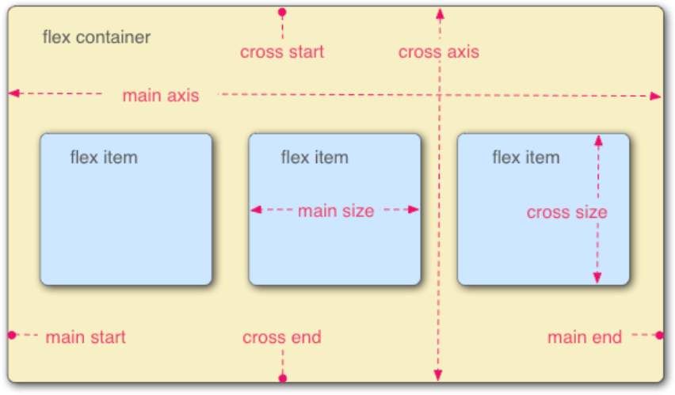

# [Flex 布局](https://www.runoob.com/w3cnote/flex-grammar.html)

> Flex是Flexible Box的缩写，意为”弹性布局”，用来为盒状模型提供最大的灵活性。
>
> 任何一个容器都可以指定为Flex布局。

```css
.box{
  display: flex;
}

/* 行内元素也可以是使用Flex布局 */
.box{
  display: inline-flex;
}
/* Webkit内核的浏览器，必须加上-webkit前缀。 */
.box{
  display: -webkit-flex; /* Safari */
  display: flex;
}

```

> 设为Flex布局以后，子元素的float、clear和vertical-align属性将失效。

## 基本概念



## 容器属性

###  flex-direction

flex-direction属性决定主轴的方向（即项目的排列方向）
- row（默认值）：主轴为水平方向，起点在左端。
- row-reverse：主轴为水平方向，起点在右端。
- column：主轴为垂直方向，起点在上沿。
- column-reverse：主轴为垂直方向，起点在下沿。

### flex-wrap

- nowrap（默认）：不换行。
- wrap：换行，第一行在上方。
- wrap-reverse：换行，第一行在下方。

###  flex-flow

flex-flow属性是flex-direction属性和flex-wrap属性的简写形式，默认值为row nowrap。

```css
.box {
  flex-flow: <flex-direction> <flex-wrap>;
}
```

###  justify-content属性

定义了项目在主轴上的对齐方式。

- flex-start（默认值）：左对齐
- flex-end：右对齐
- center： 居中
- space-between：两端对齐，项目之间的间隔都相等。
- space-around：每个项目两侧的间隔相等。所以，项目之间的间隔比项目与边框的间隔大一倍。

### align-items属性

定义项目在交叉轴上如何对齐。

- flex-start：交叉轴的起点对齐。
- flex-end：交叉轴的终点对齐。
- center：交叉轴的中点对齐。
- baseline: 项目的第一行文字的基线对齐。
- stretch（默认值）：如果项目未设置高度或设为auto，将占满整个容器的高度。

### align-content属性

定义了多根轴线的对齐方式。如果项目只有一根轴线，该属性不起作用。

- flex-start：与交叉轴的起点对齐。
- flex-end：与交叉轴的终点对齐。
- center：与交叉轴的中点对齐。
- space-between：与交叉轴两端对齐，轴线之间的间隔平均分布。
- space-around：每根轴线两侧的间隔都相等。所以，轴线之间的间隔比轴线与边框的间隔大一倍。
- stretch（默认值）：轴线占满整个交叉轴。

## item 属性

### order属性

定义项目的排列顺序。数值越小，排列越靠前，默认为0。

### flex-grow 属性

flex-grow属性定义项目的放大比例，默认为0，即如果存在剩余空间，也不放大。

如果所有项目的flex-grow属性都为1，则它们将等分剩余空间（如果有的话）。如果一个项目的flex-grow属性为2，其他项目都为1，则前者占据的剩余空间将比其他项多一倍。

### flex-shrink属性

flex-shrink属性定义了项目的缩小比例，默认为1，即如果空间不足，该项目将缩小。

###  flex-basis属性

flex-basis属性定义了在分配多余空间之前，项目占据的主轴空间（main size）。浏览器根据这个属性，计算主轴是否有多余空间。它的默认值为auto，即项目的本来大小。

### flex属性

flex属性是flex-grow, flex-shrink 和 flex-basis的简写，默认值为0 1 auto。后两个属性可选。

```css
.item {
  flex: none | [ <'flex-grow'> <'flex-shrink'>? || <'flex-basis'> ]
}
```

该属性有两个快捷值：auto (1 1 auto) 和 none (0 0 auto)。

### align-self属性

align-self属性允许单个项目有与其他项目不一样的对齐方式，可覆盖align-items属性。


# [`footer`标签](https://www.runoob.com/tags/tag-footer.html)

> 块级元素

